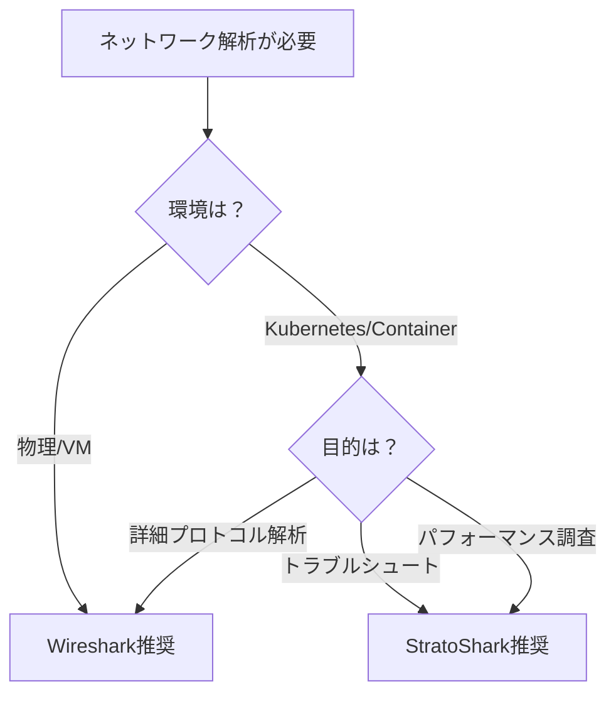

# Wiresharkとの違い

## 本章の目的

前章でStratoSharkの概要を学びました。本章では、**なぜWiresharkという強力なツールがあるのにStratoSharkが必要なのか**を深く理解していきます。

## Wiresharkの歴史と課題

### Wiresharkの誕生（1998年〜）

Wireshark（当初はEthereal）は、**Gerald Combs氏によって1998年に開発が開始**されました。以来25年以上にわたり、ネットワーク解析のデファクトスタンダードとして進化を続けています。

### Wiresharkの強み

| 強み | 詳細 |
|------|------|
| **プロトコルサポート** | 3000以上のプロトコルに対応 |
| **詳細な解析** | パケットの各フィールドを完全に解析 |
| **クロスプラットフォーム** | Windows/macOS/Linux対応 |
| **成熟したツール** | 20年以上の実績と豊富なドキュメント |
| **強力なフィルタ** | 柔軟な表示フィルタとキャプチャフィルタ |

### しかし、クラウド時代の課題も

Wiresharkは強力ですが、**クラウドネイティブ環境では以下の課題**があります。

## 従来のパケットキャプチャの限界

### 課題1: root権限が必須

**問題点**
```bash
# tcpdumpやWiresharkでキャプチャするには...
sudo tcpdump -i eth0
# または
sudo wireshark
```

- 本番環境でroot権限を付与するのはセキュリティリスク
- 開発者が気軽にデバッグできない
- 権限昇格の申請プロセスが煩雑

**StratoSharkの解決策**

eBPFのcapability機能を活用：
```bash
# CAP_BPF capability があれば一般ユーザーでも実行可能
stratoshark capture --interface eth0
```

:::message
**capability とは？**
Linux のcapability機能を使うと、root権限を全て渡さずに、必要な権限だけを付与できます。
```bash
sudo setcap cap_bpf+ep /usr/bin/stratoshark
```
:::

### 課題2: Kubernetes環境での複雑さ

**Pod内でのキャプチャの難しさ**

従来の方法：
```bash
# 1. Podに入る
kubectl exec -it my-pod -- /bin/sh

# 2. tcpdumpをインストール（できない場合も）
apt-get update && apt-get install tcpdump

# 3. キャプチャ
tcpdump -i eth0 -w capture.pcap

# 4. ファイルを取り出す
kubectl cp my-pod:/capture.pcap ./capture.pcap
```

**問題点**
- Podにツールをインストールする必要がある（distrolessイメージでは不可能）
- 一時的にコンテナを変更してしまう
- NetworkPolicyで制限されている場合がある
- Sidecarパターンが必要になることも

**StratoSharkの解決策**

```bash
# ホストから直接Podをターゲット指定
stratoshark capture \
  --pod my-app-pod-xyz \
  --namespace production \
  --output pod-traffic.pcap
```

- Podに入る必要なし
- イメージの変更不要
- eBPFで直接カーネルレベルでキャプチャ

### 課題3: カーネルバージョン依存

**libpcap/BPFの制約**

Wiresharkが使用するlibpcapは、古いカーネルでも動作しますが：

- 新しいネットワーク機能（eBPF XDP等）に対応しづらい
- カーネル空間でのフィルタリングが限定的
- パフォーマンスオーバーヘッドが大きい

**eBPFの利点**

```
┌────────────────────────────────────────┐
│     Traditional Capture (libpcap)      │
└────────────────────────────────────────┘
  Kernel → User Space → Filter → Analyze
  (すべてのパケットをUser Spaceにコピー)

┌────────────────────────────────────────┐
│      eBPF-based Capture                │
└────────────────────────────────────────┘
  Kernel (Filter) → User Space → Analyze
  (必要なパケットのみUser Spaceへ)
```

### 課題4: Service Meshの可視性

**暗号化トラフィックの課題**

Istio/Linkerdなどのservice meshでは、mTLS（mutual TLS）により通信が暗号化されます。

従来の方法：
```bash
# 暗号化された通信は中身が見えない
tcpdump -i eth0 -A
# => 暗号化データが見えるだけ
```

**StratoSharkのアプローチ**

eBPFを使えば、**暗号化前/復号化後のデータをキャプチャ可能**：

```bash
# SSL/TLSのシステムコールをフック
stratoshark capture --ssl-keylog
```

:::message
**SSL/TLS復号化の仕組み**
StratoSharkはeBPFで `SSL_read()` / `SSL_write()` をフックし、アプリケーションレベルでデータをキャプチャします。
:::

## 詳細な比較表

### 技術的な違い

| 項目 | Wireshark | StratoShark |
|------|-----------|-------------|
| **キャプチャ方式** | libpcap/WinPcap | eBPF |
| **フィルタリング場所** | User Space | Kernel Space |
| **権限** | root必須 | CAP_BPF可 |
| **オーバーヘッド** | 中〜高 | 低 |
| **リアルタイム解析** | 制限あり | 高速 |
| **コンテナ対応** | 間接的 | ネイティブ |

### 機能的な違い

| 機能 | Wireshark | StratoShark |
|------|-----------|-------------|
| **プロトコル数** | 3000+ | 数百（今後拡大） |
| **GUI** | 非常に成熟 | 開発中 |
| **CLI** | tshark | stratoshark CLI |
| **統計機能** | 豊富 | 基本的な機能 |
| **プラグイン** | Lua等で拡張可能 | eBPFプログラムで拡張 |

### 使い分けのガイドライン



## 実例で見る違い

### 例1: HTTPSトラフィックの解析

**Wiresharkの場合**
```bash
# 1. SSLキーログを有効化
export SSLKEYLOGFILE=/tmp/ssl-keys.log

# 2. アプリケーション起動

# 3. Wiresharkでキャプチャ

# 4. SSLキーログを読み込んで復号化
```

**StratoSharkの場合**
```bash
# eBPFで直接SSL関数をフック
stratoshark capture --ssl-keylog --filter "https"
```

### 例2: Kubernetes DNSトラブルシュート

**Wiresharkの場合**
```bash
# 1. CoreDNS Podに入る
kubectl exec -it coredns-xxx -n kube-system -- sh

# 2. tcpdumpインストール（できない）

# 3. 別の方法を探す...
```

**StratoSharkの場合**
```bash
# ホストから直接キャプチャ
stratoshark capture \
  --namespace kube-system \
  --pod coredns-xxx \
  --filter "dns"
```

## eBPFとイベントドリブンアーキテクチャ

### 従来のパケットキャプチャ

```
Application → TCP/IP Stack → NIC → [Copy all] → User Space → Filter
```

問題点：
- すべてのパケットをUser Spaceにコピー
- フィルタリングがUser Spaceで実行される
- CPU/メモリオーバーヘッドが大きい

### StratoSharkのアプローチ

```
Application → TCP/IP Stack → [eBPF Filter] → Event → User Space
```

利点：
- カーネル空間で早期フィルタリング
- 必要なイベントのみUser Spaceへ
- 低オーバーヘッド

## まとめ

### WiresharkとStratoSharkは共存する

StratoSharkは、**Wiresharkを置き換えるものではありません**。それぞれの強みを理解して使い分けることが重要です。

**Wiresharkを使うべき場合**
- 詳細なプロトコル解析が必要
- Windows/macOS環境
- オフライン解析
- 3000+のプロトコルサポートが必要

**StratoSharkを使うべき場合**
- Kubernetes/コンテナ環境
- リアルタイムトラブルシュート
- 低オーバーヘッドが要求される
- eBPFベースのイベントトレーシング

次章では、StratoSharkの内部アーキテクチャとeBPFの仕組みについて詳しく学んでいきます。

## 参考リソース

- [libpcap公式サイト](https://www.tcpdump.org/)
- [eBPF vs Traditional Packet Capture](https://ebpf.io/what-is-ebpf/)
- [Kubernetes Network Debugging Guide](https://kubernetes.io/docs/tasks/debug/)
