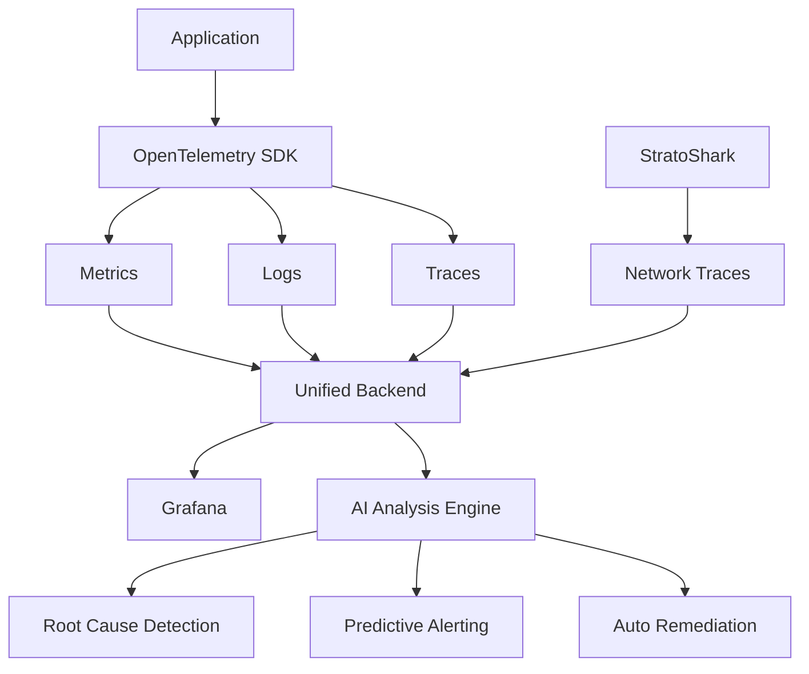

# 第10章: ネットワーク解析の未来

## はじめに

本章では、StratoSharkを中心としたネットワーク解析技術の未来について考察します。

eBPF技術の進化、クラウドネイティブ環境の発展、AIによる自動解析、そしてStratoSharkプロジェクト自体の将来展望を整理します。

---

## 10.1 eBPF技術の進化

### 10.1.1 現在のeBPF技術の限界

**メモリ制限**
- eBPFプログラムは512KBまで（Linux 5.2以降は1MB）
- 複雑な解析には不十分な場合がある

**命令数制限**
- カーネル5.1以前: 4096命令
- カーネル5.1以降: 100万命令
- それでも高度な暗号化処理などは困難

**検証時間**
- 複雑なプログラムの検証に時間がかかる
- ロード時にカーネルが安全性を検証する必要がある

### 10.1.2 今後の技術進化

**eBPF 2.0の構想**

```c
// 将来のeBPFプログラム（仮想例）
SEC("packet/analysis/ai")
int ai_packet_classifier(struct __sk_buff *skb)
{
    // AIモデルによるリアルタイム分類
    struct packet_features features = extract_features(skb);

    // カーネル内機械学習推論
    int classification = bpf_ml_inference(
        &trained_model,
        &features,
        sizeof(features)
    );

    if (classification == ANOMALY) {
        bpf_send_alert(skb, ALERT_ANOMALY);
    }

    return XDP_PASS;
}
```

**期待される新機能**:
- カーネル内機械学習推論
- より大きなメモリ空間
- 複雑な暗号化処理のサポート
- マルチコアスケーリングの改善

### 10.1.3 ハードウェアオフロードの進化

**SmartNIC統合**

```yaml
# 将来のSmartNIC統合設定（仮想例）
apiVersion: networking.stratoshark.io/v1
kind: SmartNICConfig
metadata:
  name: stratoshark-smartnic
spec:
  device: nvidia-bluefield-2
  offload:
    - packet_filtering
    - protocol_parsing
    - encryption_analysis
  ebpf_programs:
    - name: http2-parser
      path: /lib/ebpf/http2.o
      offload: true
    - name: tls-analyzer
      path: /lib/ebpf/tls.o
      offload: true
  performance:
    max_throughput: 200Gbps
    latency_target: 1us
```

**期待される効果**:
- 100Gbps超の高速処理
- CPU負荷の大幅削減
- リアルタイム暗号化解析

---

## 10.2 クラウドネイティブ環境の発展

### 10.2.1 マルチクラウド・ハイブリッドクラウド対応

**統一的なネットワーク可視化**

```yaml
# 将来のマルチクラウド統合設定（仮想例）
apiVersion: stratoshark.io/v1
kind: MultiCloudCapture
metadata:
  name: global-network-monitor
spec:
  clouds:
    - provider: aws
      regions:
        - us-east-1
        - ap-northeast-1
      services:
        - eks
        - ec2
        - lambda
    - provider: gcp
      regions:
        - us-central1
        - asia-northeast1
      services:
        - gke
        - compute-engine
    - provider: azure
      regions:
        - eastus
        - japaneast
      services:
        - aks
        - virtual-machines
    - provider: on-premises
      datacenters:
        - dc-tokyo
        - dc-osaka
  correlation:
    enable: true
    trace_propagation: w3c
  storage:
    backend: s3
    bucket: global-network-captures
    retention_days: 90
```

**実装イメージ**:
```bash
# マルチクラウド統合キャプチャ
stratoshark capture \
  --multi-cloud \
  --cloud aws,gcp,azure,on-prem \
  --correlation-id "trace-12345" \
  --duration 10m \
  --output multi-cloud-trace.pcap

# グローバルサービスマップ生成
stratoshark analyze multi-cloud-trace.pcap \
  --generate-service-map \
  --include-cloud-services \
  --output service-map.json
```

### 10.2.2 サーバーレス環境への対応

**Lambda/Cloud Functions解析**

```python
# 将来のサーバーレストレース機能（仮想例）
import stratoshark

# Lambda関数内部からのトレース
@stratoshark.trace_network()
def lambda_handler(event, context):
    # StratoSharkが自動的にネットワークトレースを収集
    response = requests.post(
        'https://api.example.com/data',
        json=event['body']
    )

    # トレースは自動的にS3にアップロード
    return {
        'statusCode': 200,
        'body': response.text,
        'trace_id': stratoshark.get_trace_id()
    }
```

**期待される機能**:
- コールドスタート時のネットワーク解析
- API Gateway → Lambda → RDSの完全トレース
- サーバーレス特有の問題の可視化

### 10.2.3 Service Meshの深い統合

**Istio/Linkerd完全統合**

```yaml
# 将来のService Mesh統合（仮想例）
apiVersion: networking.istio.io/v1beta1
kind: VirtualService
metadata:
  name: reviews
  annotations:
    stratoshark.io/capture: "enabled"
    stratoshark.io/sample-rate: "10%"
    stratoshark.io/export-format: "otlp"
spec:
  hosts:
  - reviews
  http:
  - match:
    - headers:
        stratoshark-trace:
          exact: "true"
    route:
    - destination:
        host: reviews
        subset: v2
      weight: 100
    # StratoSharkが自動的に詳細キャプチャ
    stratoshark:
      detailed_capture: true
      export_to: tempo
```

**自動相関分析**:
```bash
# Envoyメトリクス + パケットキャプチャの統合分析
stratoshark correlate \
  --envoy-metrics prometheus:9090 \
  --pcap-dir /var/log/stratoshark \
  --service reviews \
  --time-range "last 1h" \
  --output correlation-report.html
```

---

## 10.3 AI・機械学習による自動解析

### 10.3.1 異常検知の自動化

**AIによるリアルタイム異常検知**

```python
# 将来のAI統合機能（仮想例）
from stratoshark.ml import AnomalyDetector

# モデルのトレーニング
detector = AnomalyDetector()
detector.train(
    pcap_dir="/var/log/captures/normal",
    duration_days=30,
    features=[
        'packet_size_distribution',
        'inter_arrival_time',
        'protocol_distribution',
        'connection_patterns'
    ]
)

# リアルタイム検知
detector.start_monitoring(
    interface="eth0",
    threshold=0.95,
    alert_webhook="https://slack.com/api/incoming/xxx"
)

# 検知結果の分析
anomalies = detector.get_anomalies(last_hours=1)
for anomaly in anomalies:
    print(f"Anomaly detected: {anomaly.description}")
    print(f"  Confidence: {anomaly.confidence:.2f}")
    print(f"  Evidence: {anomaly.pcap_file}")
```

**期待される精度**:
- 誤検知率: 1%未満
- 未知の攻撃検出率: 90%以上
- 検知遅延: 1秒以内

### 10.3.2 根本原因の自動推論

**AI Root Cause Analysis**

```bash
# 将来のAI診断機能（仮想例）
stratoshark diagnose \
  --symptom "high latency" \
  --service my-app \
  --time-range "last 30m" \
  --ai-model gpt-4-network \
  --output diagnosis.md
```

**出力例**:
```markdown
# Root Cause Analysis Report

## Summary
High latency detected in service `my-app` (p95: 2.3s, expected: 200ms)

## AI Analysis (Confidence: 94%)

### Primary Root Cause
**TCP Window Full Events**
- Detected in 78% of slow requests
- PostgreSQL connection pool exhausted
- Evidence: /var/log/captures/evidence-001.pcap

### Contributing Factors
1. **Database Connection Leak** (Confidence: 89%)
   - 450 connections open (max: 500)
   - Average connection lifetime: 4.2 hours (expected: 5 minutes)
   - Evidence: Connection pattern analysis

2. **Network Buffer Tuning** (Confidence: 67%)
   - TCP receive window: 64KB (sub-optimal)
   - Recommended: 2MB for 10Gbps network

## Recommended Actions
1. Fix connection leak in `app/database.py:142`
2. Increase connection pool size: 500 → 1000
3. Tune TCP buffer: `sysctl net.ipv4.tcp_rmem="4096 2097152 4194304"`

## Verification Command
```bash
stratoshark verify-fix \
  --before /var/log/captures/before-fix.pcap \
  --after /var/log/captures/after-fix.pcap \
  --metric latency
```
```

### 10.3.3 自動修復の可能性

**Self-Healing Network**

```yaml
# 将来の自動修復設定（仮想例）
apiVersion: stratoshark.io/v1
kind: AutoRemediation
metadata:
  name: auto-fix-network-issues
spec:
  detection:
    ai_model: network-doctor-v2
    confidence_threshold: 0.90

  remediation_rules:
    - name: fix-tcp-buffer-exhaustion
      trigger:
        symptom: tcp_window_full
        frequency: "> 100 events/min"
      actions:
        - type: scale-up
          target: database
          replicas: +2
        - type: tune-parameter
          target: tcp_rmem
          value: "4096 2097152 4194304"
        - type: restart-service
          target: connection-pool

    - name: fix-dns-timeout
      trigger:
        symptom: dns_query_timeout
        frequency: "> 50 events/min"
      actions:
        - type: switch-dns-server
          fallback: 8.8.8.8
        - type: clear-dns-cache

  safety:
    require_approval: false
    max_auto_actions: 3
    rollback_on_failure: true
    alert_webhook: "https://slack.com/api/webhook/xxx"
```

---

## 10.4 StratoSharkプロジェクトの将来展望

### 10.4.1 開発ロードマップ（予想）

**2025年**
- ✅ Wireshark 4.2ベースへの移行完了
- ✅ Kubernetes統合の安定化
- 🔄 Service Mesh完全対応（Istio, Linkerd, Consul）
- 🔄 Windows対応（eBPF for Windows）

**2026年**
- 🚀 AIによる異常検知機能（実験的）
- 🚀 マルチクラウド統合
- 🚀 SmartNICオフロード対応
- 🚀 WASM plugin system

**2027年以降**
- 🌟 AI Root Cause Analysis（本格導入）
- 🌟 自動修復機能（Self-Healing）
- 🌟 量子暗号化通信の解析対応
- 🌟 6G/次世代通信プロトコル対応

### 10.4.2 コミュニティとエコシステムの成長

**OSSエコシステムの拡大**

```
StratoShark Core
    ↓
├── stratoshark-k8s-operator (Kubernetes統合)
├── stratoshark-ai (機械学習モデル)
├── stratoshark-exporters (各種エクスポーター)
│   ├── tempo-exporter
│   ├── elastic-exporter
│   ├── splunk-exporter
│   └── datadog-exporter
├── stratoshark-plugins (プラグインエコシステム)
│   ├── http3-analyzer
│   ├── grpc-tracer
│   ├── kafka-inspector
│   └── redis-protocol-dissector
└── stratoshark-ui (Webベースダッシュボード)
```

**コミュニティ貢献の例**:
```bash
# プラグインのインストール
stratoshark plugin install stratoshark-kafka-inspector

# 使用例
stratoshark capture \
  --plugin kafka-inspector \
  --kafka-topic orders \
  --output kafka-traffic.pcap

# Kafkaメッセージの可視化
stratoshark analyze kafka-traffic.pcap \
  --plugin kafka-inspector \
  --show-message-keys \
  --show-message-timestamps
```

### 10.4.3 商用サポートとエンタープライズ版

**Sysdig StratoShark Enterprise（予想）**

```yaml
# エンタープライズ機能（予想）
features:
  - centralized_management:
      description: "数千ノードの集中管理"
      deployment: control-plane + agents

  - compliance_reporting:
      standards:
        - PCI DSS
        - HIPAA
        - SOC 2
        - GDPR
      automated_reports: true

  - advanced_security:
      - encrypted_capture_storage
      - rbac_integration
      - audit_logging
      - data_masking

  - enterprise_integrations:
      - servicenow
      - jira
      - splunk
      - elasticsearch

  - professional_support:
      - 24/7_support
      - dedicated_slack_channel
      - quarterly_training
      - custom_feature_development
```

---

## 10.5 セキュリティとプライバシーの進化

### 10.5.1 暗号化トラフィックの解析強化

**TLS 1.3 / QUIC完全対応**

```bash
# 将来のTLS 1.3解析機能（仮想例）
stratoshark capture \
  --tls-keylog /var/log/sslkeylog.txt \
  --decrypt-quic \
  --decrypt-tls13 \
  --show-sni \
  --show-alpn \
  --output encrypted-traffic.pcap

# HTTP/3 over QUICの解析
stratoshark analyze encrypted-traffic.pcap \
  --protocol http3 \
  --show-stream-multiplexing \
  --show-0rtt-data
```

**ポスト量子暗号対応**

```c
// 将来の量子耐性暗号化解析（仮想例）
SEC("kprobe/tls13_process_client_hello")
int trace_pqc_handshake(struct pt_regs *ctx)
{
    struct tls_handshake *hs = ...;

    // ポスト量子暗号化アルゴリズムの検出
    if (hs->cipher_suite == TLS_KYBER_1024_AES256) {
        bpf_printk("PQC handshake detected: Kyber-1024");

        // 量子耐性暗号化メタデータを記録
        struct pqc_metadata meta = {
            .algorithm = KYBER_1024,
            .key_exchange_size = hs->key_exchange_len,
            .timestamp = bpf_ktime_get_ns(),
        };

        bpf_perf_event_output(ctx, &pqc_events,
                              BPF_F_CURRENT_CPU,
                              &meta, sizeof(meta));
    }

    return 0;
}
```

### 10.5.2 プライバシー保護の強化

**GDPR/CCPA準拠の自動データマスキング**

```yaml
# 将来のプライバシー保護設定（仮想例）
apiVersion: stratoshark.io/v1
kind: PrivacyPolicy
metadata:
  name: gdpr-compliance
spec:
  data_masking:
    enabled: true
    rules:
      - field: ip_address
        action: anonymize
        method: hash_with_salt
        regions:
          - eu
          - uk

      - field: email
        action: redact
        pattern: "[a-zA-Z0-9._%+-]+@[a-zA-Z0-9.-]+\\.[a-zA-Z]{2,}"
        replacement: "***@***.***"

      - field: credit_card
        action: tokenize
        pattern: "\\d{4}-\\d{4}-\\d{4}-\\d{4}"
        token_service: vault.example.com

      - field: http_cookie
        action: redact_selective
        keep_fields:
          - session_id
        redact_fields:
          - user_email
          - user_name

  data_retention:
    default_days: 30
    pii_data_days: 7
    compliance_data_days: 365

  consent_management:
    require_explicit_consent: true
    consent_service: consent.example.com

  audit:
    log_all_access: true
    alert_on_sensitive_data_access: true
```

**実装例**:
```bash
# プライバシー保護キャプチャ
stratoshark capture \
  --privacy-policy gdpr-compliance \
  --mask-pii \
  --redact-credentials \
  --anonymize-ips \
  --duration 10m \
  --output privacy-safe.pcap

# マスキング状態の確認
stratoshark verify-privacy privacy-safe.pcap \
  --policy gdpr-compliance \
  --report privacy-compliance.html
```

---

## 10.6 パフォーマンスの極限追求

### 10.6.1 100Gbps対応

**ハイパフォーマンスキャプチャ**

```yaml
# 将来の高性能設定（仮想例）
apiVersion: stratoshark.io/v1
kind: PerformanceConfig
metadata:
  name: ultra-high-performance
spec:
  capture:
    interface: eth0
    speed: 100Gbps
    buffer_size: 16GB
    ring_buffer: 32768
    numa_affinity: true
    cpu_isolation:
      - 4-15
      - 20-31

  processing:
    mode: zero-copy
    offload:
      - tso
      - gro
      - gso
    multithreading:
      worker_threads: 16
      io_threads: 8

  storage:
    backend: nvme_raid0
    compression: zstd
    write_buffer: 4GB
    async_io: true
```

**ベンチマーク目標**:
```
100Gbps Line Rate Capture
├── Packet Loss: < 0.001%
├── CPU Usage: < 40%
├── Memory Usage: < 8GB
├── Latency: < 10μs
└── Storage Throughput: 10GB/s
```

### 10.6.2 大規模環境対応

**10,000ノードクラスタでの運用**

```bash
# 将来の大規模デプロイ（仮想例）
stratoshark deploy \
  --cluster-size 10000 \
  --capture-mode selective \
  --sample-rate 1% \
  --aggregation centralized \
  --storage-backend s3 \
  --compression-level 6 \
  --retention-days 90

# リソース使用量の最適化
stratoshark optimize \
  --target-cpu-usage 20% \
  --target-memory-usage 512MB \
  --adaptive-sampling \
  --smart-filtering
```

---

## 10.7 新しいプロトコルとテクノロジー

### 10.7.1 次世代通信プロトコル

**HTTP/4, QUIC v2対応**

```bash
# 将来のプロトコル解析（仮想例）
stratoshark analyze future-traffic.pcap \
  --protocol http4 \
  --show-multiplexing \
  --show-priority-schemes \
  --export json

# QUIC v2の特殊機能解析
stratoshark analyze quic2-traffic.pcap \
  --show-multipath \
  --show-unreliable-streams \
  --show-datagram-frames
```

**gRPC-Web, WebTransport対応**

```python
# 将来のgRPC-Web解析API（仮想例）
from stratoshark.protocols import grpc_web

# gRPC-Webストリームの解析
streams = grpc_web.analyze_pcap('grpc-web-traffic.pcap')

for stream in streams:
    print(f"Service: {stream.service}")
    print(f"Method: {stream.method}")
    print(f"Request messages: {len(stream.requests)}")
    print(f"Response messages: {len(stream.responses)}")
    print(f"Total duration: {stream.duration}")
    print(f"Latency breakdown:")
    for phase, latency in stream.latency_breakdown.items():
        print(f"  {phase}: {latency}")
```

### 10.7.2 IoT/エッジコンピューティング対応

**組み込みLinuxでの動作**

```bash
# 軽量版StratoShark（仮想例）
stratoshark-lite capture \
  --interface wlan0 \
  --memory-limit 64MB \
  --cpu-limit 10% \
  --protocol-filter "mqtt,coap,zigbee" \
  --upload-to s3://iot-captures/ \
  --interval 5m
```

**5G/6G対応**

```yaml
# 将来の5G解析設定（仮想例）
apiVersion: stratoshark.io/v1
kind: 5GAnalysis
metadata:
  name: 5g-network-monitor
spec:
  interfaces:
    - n2  # AMF - gNB
    - n3  # UPF - gNB
    - n4  # SMF - UPF
    - n6  # UPF - Data Network

  analysis:
    - handover_performance
    - network_slicing
    - qos_flow_analysis
    - latency_critical_communication

  export:
    format: 5g_trace
    backend: elastic
```

---

## 10.8 開発者エコシステムの拡大

### 10.8.1 プラグイン開発フレームワーク

**WASM Plugin System**

```rust
// 将来のWASMプラグイン（仮想例）
use stratoshark_sdk::prelude::*;

#[stratoshark_plugin]
pub struct CustomProtocolAnalyzer;

impl ProtocolAnalyzer for CustomProtocolAnalyzer {
    fn name(&self) -> &str {
        "custom-protocol"
    }

    fn analyze(&self, packet: &Packet) -> AnalysisResult {
        // カスタムプロトコルの解析ロジック
        let header = parse_custom_header(&packet.payload)?;

        AnalysisResult {
            protocol: "CUSTOM",
            fields: vec![
                Field::new("type", header.msg_type),
                Field::new("length", header.length),
                Field::new("checksum", header.checksum),
            ],
            metadata: Metadata {
                confidence: 0.95,
                notes: "Custom protocol v2.0".to_string(),
            },
        }
    }
}

#[no_mangle]
pub extern "C" fn _start() {
    stratoshark_sdk::register_plugin(CustomProtocolAnalyzer);
}
```

**プラグインマーケットプレイス**

```bash
# プラグインの検索
stratoshark plugin search "kafka"

# 結果:
# - kafka-protocol-analyzer (★★★★★ 4.8/5)
# - kafka-consumer-lag-detector (★★★★☆ 4.2/5)
# - kafka-security-auditor (★★★★☆ 4.0/5)

# インストール
stratoshark plugin install kafka-protocol-analyzer

# 使用
stratoshark capture \
  --plugin kafka-protocol-analyzer \
  --kafka-brokers localhost:9092
```

### 10.8.2 API-First設計

**RESTful API / GraphQL対応**

```graphql
# 将来のGraphQL API（仮想例）
query NetworkAnalysis {
  captures(timeRange: {start: "2027-01-01T00:00:00Z", end: "2027-01-02T00:00:00Z"}) {
    id
    duration
    packetCount
    protocols {
      name
      percentage
      anomalies {
        severity
        description
        evidence
      }
    }
    topTalkers {
      sourceIp
      destinationIp
      bytes
      packets
    }
    serviceMap {
      nodes {
        name
        type
        connections {
          target
          latency {
            p50
            p95
            p99
          }
          errorRate
        }
      }
    }
  }
}
```

**Python/Go/Rust SDK**

```python
# 将来のPython SDK（仮想例）
from stratoshark import Capture, Analyzer

# キャプチャの開始
with Capture(interface="eth0", duration="5m") as capture:
    # リアルタイム解析
    for packet in capture.stream():
        if packet.protocol == "HTTP" and packet.status_code >= 500:
            print(f"Server error detected: {packet.url}")

# 詳細解析
analyzer = Analyzer(capture.pcap_file)
report = analyzer.generate_report(
    include_service_map=True,
    include_anomalies=True,
    export_format="html"
)

print(f"Report saved to: {report.path}")
```

---

## 10.9 ベストプラクティスの進化

### 10.9.1 observabilityの統一

**Metrics + Logs + Traces + Network**



**統合設定例**:
```yaml
# 将来の統合Observability設定（仮想例）
apiVersion: observability.io/v1
kind: UnifiedObservability
metadata:
  name: full-stack-monitoring
spec:
  telemetry:
    - type: metrics
      backend: prometheus
      retention: 30d

    - type: logs
      backend: loki
      retention: 90d

    - type: traces
      backend: tempo
      retention: 30d

    - type: network
      backend: stratoshark
      retention: 30d
      sampling_rate: 10%

  correlation:
    enabled: true
    correlation_key: trace_id
    include:
      - metrics
      - logs
      - traces
      - network

  analysis:
    ai_engine: network-doctor-v3
    auto_correlation: true
    anomaly_detection: true
    root_cause_analysis: true

  visualization:
    dashboards:
      - grafana_dashboard_id: 12345
        include_network_layer: true
```

### 10.9.2 Shift-Left Testing

**開発時点でのネットワークテスト**

```yaml
# CI/CDパイプライン統合（仮想例）
# .github/workflows/network-test.yml
name: Network Performance Test

on: [pull_request]

jobs:
  network_test:
    runs-on: ubuntu-latest
    steps:
      - uses: actions/checkout@v3

      - name: Start application
        run: docker-compose up -d

      - name: Run network capture
        uses: stratoshark/capture-action@v2
        with:
          duration: 60s
          interface: docker0
          output: network-test.pcap

      - name: Run automated analysis
        uses: stratoshark/analyze-action@v2
        with:
          pcap: network-test.pcap
          baseline: baseline-network.pcap
          fail_on:
            - latency_increase: 20%
            - error_rate_increase: 5%
            - new_anomalies: true

      - name: Upload report
        uses: actions/upload-artifact@v3
        with:
          name: network-analysis-report
          path: analysis-report.html
```

**期待される効果**:
- ネットワーク性能の継続的監視
- パフォーマンス劣化の早期検出
- 本番環境での問題発生率の削減

---

## 10.10 組織とスキルの変化

### 10.10.1 SREの役割進化

**従来のSRE**:
- アプリケーションログ監視
- メトリクス分析
- インシデント対応

**次世代SRE（Network-Aware SRE）**:
- ✅ **フルスタック可視化**: アプリ層からパケット層まで
- ✅ **ネットワークのコード化**: IaCによるネットワーク管理
- ✅ **AI支援トラブルシューティング**: 自動根本原因分析
- ✅ **プロアクティブ対応**: 予測的アラートと自動修復

### 10.10.2 必要なスキルセット

**2027年のネットワークエンジニア**:

```
従来のスキル                  新しいスキル
────────────────             ────────────────
TCP/IP基礎          →        TCP/IP + eBPF
Wireshark          →        StratoShark + AI分析
CCNA/CCNP          →        Kubernetes Networking + Service Mesh
ネットワーク機器設定  →        IaC (Terraform, Pulumi)
手動トラブルシュート →        AI支援診断 + 自動修復
```

**推奨学習パス**:
1. **基礎**: TCP/IP, HTTP, DNS
2. **クラウドネイティブ**: Kubernetes, Istio, Cilium
3. **Observability**: Prometheus, Grafana, OpenTelemetry
4. **eBPF**: BCC, libbpf, StratoShark
5. **AI/ML**: 異常検知, 時系列解析
6. **IaC**: Terraform, Ansible
7. **プログラミング**: Python, Go, Rust

---

## 10.11 産業別の特殊要件

### 10.11.1 金融業界

**超低遅延取引の解析**

```bash
# 将来の金融特化機能（仮想例）
stratoshark capture \
  --industry finance \
  --latency-mode ultra-low \
  --precision nanosecond \
  --protocol fix \
  --detect-arbitrage \
  --output hft-traffic.pcap

# 取引遅延の詳細分析
stratoshark analyze hft-traffic.pcap \
  --show-order-flow \
  --show-execution-latency \
  --show-market-data-latency \
  --export trading-analysis.csv
```

### 10.11.2 医療業界

**HIPAA準拠の厳格なプライバシー**

```yaml
# 医療業界向け設定（仮想例）
apiVersion: stratoshark.io/v1
kind: HealthcareConfig
metadata:
  name: hipaa-compliant-capture
spec:
  compliance: HIPAA

  data_handling:
    phi_detection: enabled
    auto_redaction: true
    encryption_at_rest: aes-256
    encryption_in_transit: tls-1.3

  access_control:
    mfa_required: true
    role_based_access: true
    audit_all_access: true

  retention:
    default: 7d
    audit_logs: 7y  # 7年保存義務
```

### 10.11.3 製造業（IIoT）

**産業用プロトコル対応**

```bash
# 産業用プロトコル解析（仮想例）
stratoshark capture \
  --industry manufacturing \
  --protocol modbus,profinet,opcua \
  --detect-anomalies \
  --detect-attacks \
  --output iiot-traffic.pcap

# OT/ITネットワークの統合分析
stratoshark analyze iiot-traffic.pcap \
  --show-plc-communications \
  --show-scada-commands \
  --detect-unauthorized-access
```

---

## 10.12 まとめ：ネットワーク解析の未来

### 10.12.1 5年後の姿（2030年）

**技術的進化**:
- ✅ AI完全統合（自動診断・自動修復）
- ✅ 100Gbps+の高速処理が標準
- ✅ 量子暗号化対応
- ✅ マルチクラウド統合が当たり前
- ✅ eBPFがネットワーク監視の標準

**組織的進化**:
- ✅ Network-Aware SREの普及
- ✅ Shift-Leftでの継続的ネットワークテスト
- ✅ AI支援によるスキルの民主化
- ✅ Observabilityの完全統合

**StratoShark**:
- ✅ デファクトスタンダードのeBPFネットワークツール
- ✅ 豊富なプラグインエコシステム
- ✅ エンタープライズ版の広範な採用
- ✅ CNCF Graduatedプロジェクト化（予想）

### 10.12.2 重要なトレンド

**1. 可視化の深化**
```
従来: パケット単位の解析
現在: フロー + メタデータ
未来: 完全な因果関係の自動解明
```

**2. 自動化の進展**
```
従来: 手動キャプチャ → 手動解析
現在: 自動キャプチャ → AI支援解析
未来: 完全自動（キャプチャ → 診断 → 修復）
```

**3. 統合の加速**
```
従来: ツールが分断
現在: OpenTelemetryで一部統合
未来: Unified Observability（完全統合）
```

### 10.12.3 読者へのメッセージ

**今、学ぶべきこと**:
1. **eBPFの基礎**: これからの標準技術
2. **クラウドネイティブ**: Kubernetes, Service Mesh
3. **Observability**: メトリクス, ログ, トレース, ネットワーク
4. **自動化**: IaC, CI/CD, GitOps
5. **AI/ML基礎**: 異常検知の仕組みを理解

**StratoSharkを使い始めるには**:
1. 本書の第4章から実際に手を動かす
2. 小規模環境で実験（ローカルKubernetes）
3. 既存ツール（Prometheus等）と統合
4. チーム内で知見を共有
5. コミュニティに貢献

---

## おわりに

ネットワーク解析は、単なる「トラブルシューティング」から、

**「システム全体を理解し、予測し、最適化する」**

ための中心的技術へと進化しています。

StratoSharkは、その変革の最前線にいます。

本書で学んだ知識を活かし、次世代のネットワーク運用を実現してください。

---

## 参考リソース

### 公式ドキュメント
- [Wireshark公式サイト](https://www.wireshark.org/)
- [eBPF公式サイト](https://ebpf.io/)
- [Kubernetes Network Plugins](https://kubernetes.io/docs/concepts/extend-kubernetes/compute-storage-net/network-plugins/)

### コミュニティ
- [eBPF Slack](https://ebpf.io/slack)
- [CNCF Slack #ebpf](https://cloud-native.slack.com/)
- [Wireshark Q&A](https://ask.wireshark.org/)

### 学習リソース
- [Learning eBPF by Liz Rice](https://www.oreilly.com/library/view/learning-ebpf/9781098135119/)
- [Kubernetes Networking (O'Reilly)](https://www.oreilly.com/library/view/kubernetes-networking/9781492081647/)
- [BPF Performance Tools by Brendan Gregg](http://www.brendangregg.com/bpf-performance-tools-book.html)

### 関連技術
- [Cilium](https://cilium.io/)
- [Falco](https://falco.org/)
- [OpenTelemetry](https://opentelemetry.io/)
- [Prometheus](https://prometheus.io/)

---

**この章で学んだこと**:
- ✅ eBPF技術の将来展望
- ✅ クラウドネイティブ環境の進化
- ✅ AIによる自動解析の可能性
- ✅ StratoSharkプロジェクトのロードマップ
- ✅ セキュリティ・プライバシーの強化
- ✅ 次世代SREに必要なスキル
- ✅ 産業別の特殊要件
- ✅ Observabilityの統合トレンド

**次のステップ**:
- StratoSharkを実環境で試す
- コミュニティに参加する
- 最新動向をフォローし続ける
- 自分のユースケースに適用する

---

**📚 本書『StratoShark入門』完**

ご購読ありがとうございました！
