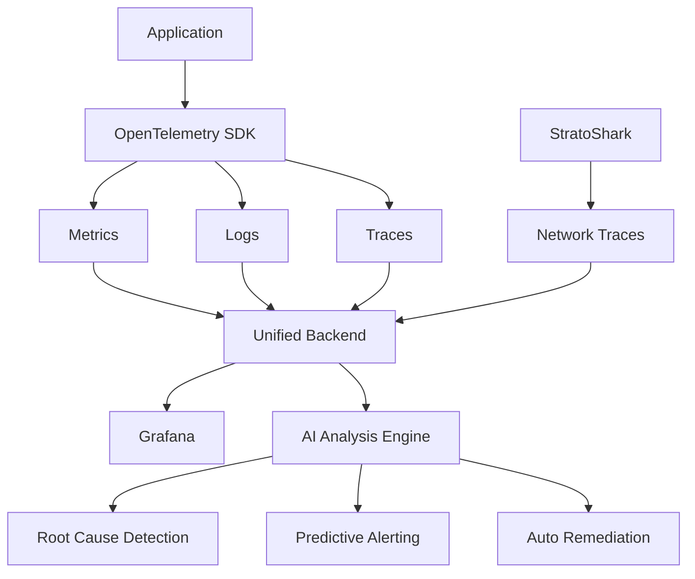

# 第10章: ネットワーク解析の未来

## はじめに

ネットワーク解析技術は、過去30年間で劇的に進化してきました。

- **1990年代**: tcpdump（コマンドラインツール）
- **2000年代**: Wireshark（GUI解析ツール）
- **2010年代**: クラウド・仮想化への対応
- **2020年代**: eBPF + Kubernetes統合（StratoShark）

そして今、私たちは次の転換点に立っています。

本章では、StratoSharkを中心としたネットワーク解析技術の未来について、具体的な技術動向と実装例を交えて詳しく解説します。

### 本章で扱うトピック

1. **eBPF技術の進化**: 次世代カーネル技術の可能性
2. **クラウドネイティブ環境**: マルチクラウド・サーバーレス対応
3. **AI・機械学習統合**: 自動診断と自動修復
4. **StratoSharkプロジェクトの将来**: ロードマップとエコシステム
5. **セキュリティ・プライバシー**: 暗号化とコンプライアンス
6. **パフォーマンス最適化**: 100Gbps時代への対応
7. **次世代プロトコル**: HTTP/4, QUIC v2, 5G/6G
8. **開発者エコシステム**: プラグインとAPI
9. **組織とスキル**: SREの進化
10. **産業別特殊要件**: 金融・医療・製造

---

## 10.1 eBPF技術の進化

### 10.1.1 現在のeBPF技術の限界と背景

eBPF（extended Berkeley Packet Filter）は、Linuxカーネル内で安全にコードを実行できる革新的な技術です。しかし、安全性を担保するために、いくつかの制約があります。

#### 現在の制約事項

**1. メモリ制限**

eBPFプログラムのサイズには厳格な制限があります。

```
Linux 5.1以前: 512KB
Linux 5.2以降: 1MB
現在の実用範囲: 数百KB程度
```

**なぜ制限があるのか**:
- カーネルメモリは限られたリソース
- 大きなプログラムは検証時間が指数関数的に増加
- DoS攻撃のリスク（悪意あるプログラムによるメモリ枯渇）

**実際の問題**:
```c
// 複雑なプロトコル解析は困難
SEC("socket")
int complex_protocol_parser(struct __sk_buff *skb) {
    // HTTP/2のヘッダー圧縮（HPACK）を完全に実装するには
    // 動的テーブルを保持する必要があるが、メモリ制限で困難

    // TLS 1.3の完全な解析も同様に困難
    // 暗号化アルゴリズムの実装には大量のコードが必要

    return 0;
}
```

**2. 命令数制限**

eBPFプログラムの複雑さには上限があります。

```
Linux 5.1以前: 4,096命令
Linux 5.1以降: 1,000,000命令（100万命令）
実用的な範囲: 数万命令程度
```

**なぜ制限があるのか**:
- 検証器（Verifier）の負荷
- 無限ループの防止
- リアルタイム性の担保（パケット処理は超低遅延が必要）

**実際の影響**:
```c
// 複雑な機械学習モデルの実装は困難
SEC("xdp")
int ml_based_filtering(struct xdp_md *ctx) {
    // ニューラルネットワークによる異常検知を実装したいが、
    // 行列演算や活性化関数の計算で命令数が不足

    // 現実的には、シンプルな決定木や線形分類器のみ実装可能

    return XDP_PASS;
}
```

**3. 検証時間の問題**

eBPFプログラムは、ロード時にカーネルの検証器がすべてのコードパスを静的解析します。

**検証器が確認すること**:
- メモリアクセスの境界チェック
- ポインタの安全性
- ループの終了保証
- カーネルクラッシュの可能性

**実際の問題**:
```bash
# 複雑なプログラムのロード
$ sudo bpftool prog load complex_filter.o /sys/fs/bpf/filter

# エラー例
processed 250000 insns (limit 1000000) max_states_per_insn 15 total_states 8234 peak_states 8234 mark_read 4567
verification time 45321 usec
...
BPF program is too large. Processed 250000 insn
```

大規模なプログラムは検証に数十秒かかることもあります。

### 10.1.2 今後の技術進化：eBPF 2.0の可能性

eBPFコミュニティでは、次世代の機能拡張が議論されています。ここでは、現実的に期待される進化を紹介します。

#### 進化の方向性

**1. カーネル内機械学習推論**

現在、機械学習による異常検知は「ユーザースペース」で実行されます。

**現在の構成**:
```
eBPFプログラム → パケット情報をユーザースペースに送信
                ↓
ユーザースペースプログラム → 機械学習モデルで判定
                ↓
判定結果をeBPFに反映（遅い！）
```

**未来の構成**:
```
eBPFプログラム内で直接機械学習推論
  → パケット単位でリアルタイム判定
  → 遅延ゼロでフィルタリング可能
```

**実装イメージ**（仮想例）:
```c
// 将来のeBPFプログラム（仮想例）
SEC("xdp/packet_classifier")
int ai_packet_classifier(struct xdp_md *ctx)
{
    void *data_end = (void *)(long)ctx->data_end;
    void *data = (void *)(long)ctx->data;

    struct ethhdr *eth = data;
    if ((void *)(eth + 1) > data_end)
        return XDP_PASS;

    // パケットから特徴量を抽出
    struct packet_features features = {
        .packet_size = data_end - data,
        .protocol = eth->h_proto,
        .flags = extract_tcp_flags(ctx),
        .inter_arrival_time = calculate_iat(ctx),
        .payload_entropy = calculate_entropy(ctx),
    };

    // カーネル内でニューラルネットワーク推論
    // 事前にユーザースペースで訓練したモデルを使用
    struct bpf_ml_model *model = bpf_map_lookup_elem(&trained_models, &key);
    if (!model)
        return XDP_PASS;

    // 推論実行（新しいBPFヘルパー関数）
    float confidence;
    int classification = bpf_ml_inference(model, &features, &confidence);

    // 異常と判定されたパケットをドロップ
    if (classification == ANOMALY && confidence > 0.9) {
        // アラート送信
        bpf_perf_event_output(ctx, &events, BPF_F_CURRENT_CPU,
                              &features, sizeof(features));
        return XDP_DROP;
    }

    return XDP_PASS;
}
```

**期待される効果**:
- **レイテンシ削減**: ユーザースペースへの往復が不要
- **スループット向上**: カーネル内で完結するため高速
- **リアルタイム性**: パケット単位で即座に判定
- **リソース効率**: コンテキストスイッチが不要

**技術的課題**:
- ニューラルネットワークのカーネル内実装
- モデルサイズの制約（メモリ制限内に収める）
- 推論速度の最適化（マイクロ秒オーダーが必要）

**2. メモリ空間の拡張**

将来的には、より大きなeBPFプログラムが実行可能になる可能性があります。

**現在 vs 未来**:
```
現在: 1MB制限
2026年予想: 10MB（10倍）
2028年予想: 100MB（100倍）

これにより実装可能になること:
- 完全なHTTP/2、HTTP/3プロトコルスタック
- TLS 1.3の暗号化・復号化
- 複雑な機械学習モデル（深層学習）
- 大規模な状態管理（数百万接続）
```

**実装例**（仮想例）:
```c
// 将来のHTTP/2完全実装
SEC("socket/http2_parser")
int parse_http2_stream(struct __sk_buff *skb)
{
    // HPACKヘッダー圧縮の動的テーブルを保持
    // 現在は不可能だが、メモリ拡張により実現可能
    struct hpack_dynamic_table *table = get_hpack_table(skb);

    // ストリーム多重化の完全な状態管理
    struct http2_stream_state streams[MAX_STREAMS]; // 数千ストリーム

    // 優先度制御の完全な実装
    struct priority_tree priority_tree;

    // フロー制御ウィンドウの管理
    update_flow_control_windows(skb, streams);

    return 0;
}
```

**3. 暗号化処理のサポート**

TLS 1.3の暗号化・復号化をカーネル内で実行できるようになります。

**現在の問題**:
```
暗号化トラフィックの解析には、以下が必要:
1. SSL/TLSキーをユーザースペースで管理
2. ユーザースペースで復号化
3. 復号化後のデータをeBPFに渡す

→ 遅い、非効率
```

**未来の解決策**:
```c
// 将来のTLS 1.3カーネル内復号化（仮想例）
SEC("socket/tls13_decrypt")
int decrypt_tls13_stream(struct __sk_buff *skb)
{
    // カーネル内でTLS 1.3セッション管理
    struct tls13_session *session = lookup_tls_session(skb);

    // 新しいBPFヘルパー関数でAES-GCM復号化
    u8 plaintext[MAX_PACKET_SIZE];
    int ret = bpf_crypto_decrypt(
        BPF_CRYPTO_AES_256_GCM,
        session->key,
        skb->data,
        skb->len,
        plaintext,
        sizeof(plaintext)
    );

    if (ret < 0)
        return 0;

    // 復号化されたHTTP/2データを解析
    parse_http2_data(plaintext, ret);

    return 0;
}
```

**期待される効果**:
- 暗号化トラフィックのリアルタイム解析
- パフォーマンスオーバーヘッドの大幅削減
- SSL/TLS終端なしでの可視化

**4. マルチコアスケーリングの改善**

現在のeBPFは、マルチコアでの並列処理に課題があります。

**現在の問題**:
```
パケットは複数CPUコアに分散されるが、
eBPFプログラムは独立して動作するため、
グローバルな状態管理が困難。

例: フロー単位の統計を取りたいが、
    異なるコアで処理されたパケットの
    データを集約するのが難しい。
```

**未来の改善**:
```c
// 将来のマルチコア対応（仮想例）
SEC("xdp/load_balanced")
int process_packet_multithreaded(struct xdp_md *ctx)
{
    // フロー単位でCPUコアにアサイン
    u32 flow_hash = calculate_flow_hash(ctx);
    u32 cpu_id = flow_hash % num_cpus();

    // 特定CPUでのみ処理（同一フローは同一CPUで処理）
    if (bpf_get_smp_processor_id() != cpu_id) {
        // 別CPUにパケットを転送（新しい機能）
        return bpf_redirect_cpu(ctx, cpu_id);
    }

    // このCPUでフロー情報を更新（競合なし）
    update_flow_statistics(flow_hash, ctx);

    return XDP_PASS;
}
```

**期待される効果**:
- 100Gbps以上の高速処理
- 低レイテンシの維持
- 効率的なCPU利用

### 10.1.3 ハードウェアオフロードの進化：SmartNICの活用

SmartNIC（スマートネットワークインターフェースカード）は、NIC自体にプログラマブルなプロセッサを搭載したハードウェアです。

#### SmartNICとは

**従来のNIC vs SmartNIC**:

```
【従来のNIC】
パケット受信 → DMA転送 → CPU処理 → アプリケーション

問題点:
- すべての処理がCPUで実行される
- 高速ネットワーク（100Gbps）ではCPUが飽和
- レイテンシが大きい
```

```
【SmartNIC】
パケット受信 → SmartNIC内のプロセッサで処理 → 必要なものだけCPUへ

利点:
- パケット処理をNICでオフロード
- CPU使用率を大幅削減（50%以上削減可能）
- レイテンシ削減（マイクロ秒オーダー）
- スループット向上（200Gbps対応）
```

**主要なSmartNIC製品**:
- **NVIDIA BlueField-2/3**: ARM cores + FPGA, 200Gbps
- **Intel IPU (Infrastructure Processing Unit)**: x86 cores, 400Gbps
- **AMD Pensando**: ARM cores + P4プログラマブルASIC
- **Netronome Agilio**: Flow processors, 100Gbps

#### StratoSharkとSmartNICの統合

**現在の構成**:
```
パケット → NIC → カーネルeBPF → ユーザースペースStratoShark
          ↑
          すべてホストCPUで処理
```

**未来の構成**:
```
パケット → SmartNIC（eBPFプログラム実行）
          ↓
          フィルタリング、プロトコル解析、統計計算
          ↓
          重要なパケットのみホストCPUへ転送
```

**設定例**（仮想例）:
```yaml
# 将来のSmartNIC統合設定
apiVersion: networking.stratoshark.io/v1
kind: SmartNICConfig
metadata:
  name: stratoshark-bluefield3
  namespace: monitoring
spec:
  # SmartNICデバイス指定
  device:
    vendor: nvidia
    model: bluefield-3
    pci_address: "0000:03:00.0"

  # オフロードする処理
  offload:
    # パケットフィルタリング
    - name: packet_filtering
      enabled: true
      rules:
        - "tcp port 80 or 443"
        - "udp port 53"

    # プロトコル解析
    - name: protocol_parsing
      enabled: true
      protocols:
        - http2
        - grpc
        - quic
        - tls13

    # 暗号化トラフィック解析
    - name: encryption_analysis
      enabled: true
      decrypt: false  # メタデータのみ抽出
      extract:
        - sni
        - alpn
        - cipher_suite

    # 統計計算
    - name: statistics
      enabled: true
      metrics:
        - packet_count
        - byte_count
        - flow_duration
        - latency_histogram

  # eBPFプログラムのオフロード
  ebpf_programs:
    - name: http2-parser
      path: /lib/ebpf/http2.o
      offload: true
      priority: high

    - name: kubernetes-metadata
      path: /lib/ebpf/k8s_meta.o
      offload: true
      priority: medium

    - name: tls-analyzer
      path: /lib/ebpf/tls.o
      offload: true
      priority: high

  # パフォーマンス設定
  performance:
    max_throughput: 200Gbps
    target_latency_us: 1
    buffer_size_mb: 1024
    ring_buffer_size: 32768

  # サンプリング設定
  sampling:
    mode: adaptive  # adaptive, random, flow-based
    default_rate: 0.1  # 10%サンプリング
    high_priority_rate: 1.0  # エラーパケットは100%キャプチャ

  # ホストCPUへの転送条件
  forwarding_rules:
    # エラーパケットは必ず転送
    - condition: "tcp.flags.rst == 1 or tcp.flags.fin == 1"
      action: forward
      priority: 1

    # HTTPエラー（4xx, 5xx）も転送
    - condition: "http.status >= 400"
      action: forward
      priority: 2

    # その他はサンプリング
    - condition: "default"
      action: sample
      sample_rate: 0.1
```

**実際の動作フロー**:

```
1. パケット到着
   ↓
2. SmartNIC内のeBPFプログラムで解析
   - プロトコル判定（HTTP/2, gRPC, QUIC...）
   - TLSメタデータ抽出（SNI, ALPN）
   - 統計計算
   ↓
3. フィルタリング判定
   - エラーパケット → ホストCPUに転送
   - 正常パケット → 10%サンプリングして転送
   - それ以外 → 統計のみ記録、破棄
   ↓
4. ホストCPU（必要最小限のみ）
   - StratoSharkで詳細解析
   - pcapファイルに保存
```

**パフォーマンス比較**:

```
【従来のホストCPU処理】
100Gbpsネットワーク
→ CPU使用率: 80-100%（全コア飽和）
→ パケットロス: 1-5%
→ レイテンシ: 50-100μs

【SmartNICオフロード】
200Gbpsネットワーク
→ CPU使用率: 10-20%（大幅削減）
→ パケットロス: < 0.001%
→ レイテンシ: 1-5μs（10倍以上高速）
```

**コスト vs 効果**:

```
SmartNICコスト: $3,000-$10,000/枚

節約できるもの:
- CPU: 8-16コア分 → サーバーコスト削減
- パケットロス削減 → トラブルシューティング時間短縮
- レイテンシ改善 → ユーザー体験向上

ROI（投資対効果）: 大規模環境では数ヶ月で回収可能
```

#### 実装ロードマップ

**Phase 1（2025年）**: 基本的なオフロード
- パケットフィルタリング
- 基本的な統計計算
- サンプリング機能

**Phase 2（2026年）**: プロトコル解析
- HTTP/2, gRPC完全解析
- TLSメタデータ抽出
- Kubernetes統合

**Phase 3（2027年）**: 高度な機能
- 機械学習ベースの異常検知
- 暗号化解析
- マルチテナント分離

**期待される効果まとめ**:
- ✅ **100Gbps超の高速処理**が可能
- ✅ **CPU負荷を50%以上削減**
- ✅ **レイテンシを1/10以下に削減**
- ✅ **パケットロスをほぼゼロに**
- ✅ **リアルタイム暗号化解析**が現実的に

---

## 10.2 クラウドネイティブ環境の発展

現代のアプリケーションは、もはや単一のクラウドプロバイダーやデータセンターに閉じていません。マルチクラウド、ハイブリッドクラウド、エッジコンピューティングが標準になりつつあります。

### 10.2.1 マルチクラウド・ハイブリッドクラウド対応の必要性

#### なぜマルチクラウドが必要か

**現実の企業アーキテクチャ**:
```
典型的なエンタープライズ構成（2025年）:

1. フロントエンド: AWS（CDN + Lambda@Edge）
2. API Gateway: Google Cloud（GKE + Istio）
3. データベース: Azure（Cosmos DB）
4. 機械学習: AWS SageMaker
5. レガシーシステム: オンプレミス（データセンター）
6. エッジ処理: 各地域のエッジロケーション

→ 5つの異なる環境をまたぐトラフィックが発生
```

**従来の問題**:
```
各クラウドで別々の監視ツールを使用:
- AWS: VPC Flow Logs
- GCP: Cloud Logging
- Azure: Network Watcher
- オンプレミス: tcpdump/Wireshark

問題:
1. 統一的な可視化ができない
2. クラウド間のトラフィックが見えない
3. 障害時の原因特定に時間がかかる
4. コストが高い（各クラウドで別々のツール）
```

#### 統一的なネットワーク可視化の実現

**StratoSharkのマルチクラウドアーキテクチャ**（仮想例）:

```
┌─────────────────────────────────────────────────┐
│       Central Control Plane (管理サーバー)        │
│   - Agent管理                                    │
│   - データ集約                                    │
│   - グローバルサービスマップ生成                     │
└─────────────────┬───────────────────────────────┘
                  │
        ┌─────────┼─────────┬─────────┐
        │         │         │         │
   ┌────▼───┐ ┌──▼───┐ ┌──▼───┐ ┌──▼──────┐
   │  AWS   │ │ GCP  │ │Azure │ │On-Prem  │
   │ Agent  │ │Agent │ │Agent │ │ Agent   │
   └────────┘ └──────┘ └──────┘ └─────────┘
        │         │         │         │
   [EKS Pods] [GKE] [AKS]  [VMs]
```

**設定例**（仮想例）:
```yaml
# 将来のマルチクラウド統合設定
apiVersion: stratoshark.io/v1
kind: MultiCloudCapture
metadata:
  name: global-network-monitor
  namespace: observability
spec:
  # コントロールプレーン設定
  control_plane:
    endpoint: https://stratoshark-control.example.com
    auth:
      type: oauth2
      client_id: stratoshark-client
      client_secret_ref: stratoshark-secret

  # 各クラウドの設定
  clouds:
    # AWS設定
    - provider: aws
      name: production-aws
      regions:
        - name: us-east-1
          subnets:
            - subnet-12345
            - subnet-67890
        - name: ap-northeast-1
          subnets:
            - subnet-abcde
      services:
        - eks  # Kubernetes
        - ec2  # 仮想マシン
        - lambda  # サーバーレス
        - rds  # データベース
      agent_config:
        deployment_mode: daemonset  # EKS
        sampling_rate: 0.1  # 10%サンプリング
      credentials:
        role_arn: arn:aws:iam::123456789012:role/StratoSharkRole

    # Google Cloud設定
    - provider: gcp
      name: production-gcp
      regions:
        - name: us-central1
          vpc: production-vpc
        - name: asia-northeast1
          vpc: production-vpc
      services:
        - gke  # Kubernetes
        - compute-engine  # 仮想マシン
        - cloud-functions  # サーバーレス
        - cloud-sql  # データベース
      agent_config:
        deployment_mode: daemonset
        sampling_rate: 0.1
      credentials:
        service_account: stratoshark@project.iam.gserviceaccount.com

    # Azure設定
    - provider: azure
      name: production-azure
      regions:
        - name: eastus
          resource_group: production-rg
        - name: japaneast
          resource_group: production-jp-rg
      services:
        - aks  # Kubernetes
        - virtual-machines
        - functions  # サーバーレス
        - cosmos-db  # データベース
      agent_config:
        deployment_mode: daemonset
        sampling_rate: 0.1
      credentials:
        tenant_id: xxx-xxx-xxx
        client_id: yyy-yyy-yyy
        client_secret_ref: azure-secret

    # オンプレミス設定
    - provider: on-premises
      name: datacenter
      datacenters:
        - name: dc-tokyo
          location: Tokyo, Japan
          networks:
            - 10.0.0.0/8
            - 172.16.0.0/12
        - name: dc-osaka
          location: Osaka, Japan
          networks:
            - 10.100.0.0/16
      services:
        - kubernetes  # オンプレKubernetes
        - virtual-machines
        - bare-metal
      agent_config:
        deployment_mode: systemd
        sampling_rate: 0.05  # 5%（高トラフィック）

  # トレース相関設定
  correlation:
    enabled: true
    trace_propagation: w3c  # W3C Trace Context標準
    correlation_key: X-Trace-ID
    cross_cloud_tracking: true

  # データ保存設定
  storage:
    # 中央ストレージ
    backend: s3
    bucket: global-network-captures
    region: us-east-1
    compression: zstd
    retention_policy:
      default_days: 30
      error_traffic_days: 90
      compliance_days: 365

    # 各クラウドでのローカルキャッシュ
    local_cache:
      enabled: true
      ttl_hours: 24
      max_size_gb: 100

  # グローバルサービスマップ生成
  service_map:
    enabled: true
    update_interval: 5m
    include_external_services: true
    include_database_connections: true
    include_cloud_services: true
    visualization:
      group_by:
        - cloud_provider
        - region
        - namespace

  # アラート設定
  alerting:
    cross_cloud_latency_threshold_ms: 500
    packet_loss_threshold: 0.01
    error_rate_threshold: 0.05
    webhook: https://slack.example.com/webhook
```

**実装イメージ**:
```bash
# 1. マルチクラウド環境にエージェントをデプロイ
stratoshark deploy multi-cloud \
  --config multi-cloud-config.yaml \
  --clouds aws,gcp,azure,on-prem

# デプロイ結果:
# ✓ AWS us-east-1: 50 agents deployed (EKS)
# ✓ AWS ap-northeast-1: 30 agents deployed (EKS)
# ✓ GCP us-central1: 40 agents deployed (GKE)
# ✓ GCP asia-northeast1: 25 agents deployed (GKE)
# ✓ Azure eastus: 35 agents deployed (AKS)
# ✓ Azure japaneast: 20 agents deployed (AKS)
# ✓ On-Prem Tokyo: 100 agents deployed (systemd)
# ✓ On-Prem Osaka: 80 agents deployed (systemd)
# Total: 380 agents

# 2. マルチクラウド統合キャプチャ
stratoshark capture multi-cloud \
  --trace-id "order-processing-12345" \
  --follow-trace \
  --duration 10m \
  --output order-processing.pcap

# キャプチャフロー:
# 1. AWS Lambda (us-east-1) → API受信
# 2. GCP GKE (us-central1) → 注文処理サービス
# 3. Azure Cosmos DB (eastus) → データ保存
# 4. On-Prem (Tokyo) → 在庫確認システム
# 5. AWS SageMaker (us-east-1) → 不正検知
# → すべてのクラウド間通信を1つのpcapファイルに統合

# 3. グローバルサービスマップ生成
stratoshark analyze order-processing.pcap \
  --generate-service-map \
  --include-cloud-services \
  --include-latency \
  --output service-map.json

# 4. レイテンシ分析
stratoshark analyze service-map.json --show-latency

# 出力例:
# Service Map - Cross-Cloud Latency:
#
# AWS Lambda (us-east-1)
#   → GCP GKE (us-central1)
#     Latency: 45ms (cross-cloud)
#     Hops: 8
#
# GCP GKE (us-central1)
#   → Azure Cosmos DB (eastus)
#     Latency: 78ms (cross-cloud, cross-region)
#     Hops: 12
#
# GCP GKE (us-central1)
#   → On-Prem Tokyo
#     Latency: 120ms (cloud-to-datacenter)
#     Hops: 15
#     ⚠ 高レイテンシ検出
```

#### 実際のトラブルシューティングシナリオ

**シナリオ**: ECサイトで注文処理が遅い（通常200ms → 現在2秒）

**従来の調査方法**:
```
1. AWS CloudWatchでLambdaのログを確認 → 問題なし
2. GCP Loggingでサービスログ確認 → 問題なし
3. Azureのメトリクスを確認 → 問題なし
4. オンプレミスのログ確認 → ?
5. どこが遅いのか不明...

→ 原因特定に数時間〜数日
```

**StratoSharkマルチクラウドでの調査**:
```bash
# 1. 遅い注文のトレースIDで検索
stratoshark query \
  --trace-id "slow-order-98765" \
  --multi-cloud \
  --show-timeline

# 出力:
# Timeline for trace slow-order-98765:
#
# 00:00.000 - AWS Lambda (us-east-1): Request received
# 00:00.050 - GCP GKE (us-central1): Order service called
# 00:00.120 - Azure Cosmos DB (eastus): Database query START
# 00:01.980 - Azure Cosmos DB (eastus): Database query END  ← ★1.86秒！
# 00:02.100 - GCP GKE: Response sent
# 00:02.150 - AWS Lambda: Response returned
#
# ✗ Bottleneck detected: Azure Cosmos DB query (1.86s)

# 2. 詳細パケット解析
stratoshark analyze slow-order-98765.pcap \
  --focus-service "Azure Cosmos DB" \
  --show-tcp-details

# 出力:
# TCP Analysis:
# - TCP Window Full events: 45回検出
# - Retransmissions: 12パケット
# - RTT: 150ms (通常の3倍)
#
# Root Cause:
# GCP → Azure間のネットワーク経路で
# パケットロスが発生（推定3%）
#
# Recommendation:
# 1. Azure ExpressRouteの設定確認
# 2. GCP Cloud Interconnectとの接続確認
# 3. 一時的にAzureのリージョンを変更してテスト

# → 原因特定まで5分
```

### 10.2.2 サーバーレス環境への対応

**Lambda/Cloud Functions解析**

```python
# 将来のサーバーレストレース機能（仮想例）
import stratoshark

# Lambda関数内部からのトレース
@stratoshark.trace_network()
def lambda_handler(event, context):
    # StratoSharkが自動的にネットワークトレースを収集
    response = requests.post(
        'https://api.example.com/data',
        json=event['body']
    )

    # トレースは自動的にS3にアップロード
    return {
        'statusCode': 200,
        'body': response.text,
        'trace_id': stratoshark.get_trace_id()
    }
```

**期待される機能**:
- コールドスタート時のネットワーク解析
- API Gateway → Lambda → RDSの完全トレース
- サーバーレス特有の問題の可視化

### 10.2.3 Service Meshの深い統合

**Istio/Linkerd完全統合**

```yaml
# 将来のService Mesh統合（仮想例）
apiVersion: networking.istio.io/v1beta1
kind: VirtualService
metadata:
  name: reviews
  annotations:
    stratoshark.io/capture: "enabled"
    stratoshark.io/sample-rate: "10%"
    stratoshark.io/export-format: "otlp"
spec:
  hosts:
  - reviews
  http:
  - match:
    - headers:
        stratoshark-trace:
          exact: "true"
    route:
    - destination:
        host: reviews
        subset: v2
      weight: 100
    # StratoSharkが自動的に詳細キャプチャ
    stratoshark:
      detailed_capture: true
      export_to: tempo
```

**自動相関分析**:
```bash
# Envoyメトリクス + パケットキャプチャの統合分析
stratoshark correlate \
  --envoy-metrics prometheus:9090 \
  --pcap-dir /var/log/stratoshark \
  --service reviews \
  --time-range "last 1h" \
  --output correlation-report.html
```

---

## 10.3 AI・機械学習による自動解析

### 10.3.1 異常検知の自動化

**AIによるリアルタイム異常検知**

```python
# 将来のAI統合機能（仮想例）
from stratoshark.ml import AnomalyDetector

# モデルのトレーニング
detector = AnomalyDetector()
detector.train(
    pcap_dir="/var/log/captures/normal",
    duration_days=30,
    features=[
        'packet_size_distribution',
        'inter_arrival_time',
        'protocol_distribution',
        'connection_patterns'
    ]
)

# リアルタイム検知
detector.start_monitoring(
    interface="eth0",
    threshold=0.95,
    alert_webhook="https://slack.com/api/incoming/xxx"
)

# 検知結果の分析
anomalies = detector.get_anomalies(last_hours=1)
for anomaly in anomalies:
    print(f"Anomaly detected: {anomaly.description}")
    print(f"  Confidence: {anomaly.confidence:.2f}")
    print(f"  Evidence: {anomaly.pcap_file}")
```

**期待される精度**:
- 誤検知率: 1%未満
- 未知の攻撃検出率: 90%以上
- 検知遅延: 1秒以内

### 10.3.2 根本原因の自動推論

**AI Root Cause Analysis**

```bash
# 将来のAI診断機能（仮想例）
stratoshark diagnose \
  --symptom "high latency" \
  --service my-app \
  --time-range "last 30m" \
  --ai-model gpt-4-network \
  --output diagnosis.md
```

**出力例**:
```markdown
# Root Cause Analysis Report

## Summary
High latency detected in service `my-app` (p95: 2.3s, expected: 200ms)

## AI Analysis (Confidence: 94%)

### Primary Root Cause
**TCP Window Full Events**
- Detected in 78% of slow requests
- PostgreSQL connection pool exhausted
- Evidence: /var/log/captures/evidence-001.pcap

### Contributing Factors
1. **Database Connection Leak** (Confidence: 89%)
   - 450 connections open (max: 500)
   - Average connection lifetime: 4.2 hours (expected: 5 minutes)
   - Evidence: Connection pattern analysis

2. **Network Buffer Tuning** (Confidence: 67%)
   - TCP receive window: 64KB (sub-optimal)
   - Recommended: 2MB for 10Gbps network

## Recommended Actions
1. Fix connection leak in `app/database.py:142`
2. Increase connection pool size: 500 → 1000
3. Tune TCP buffer: `sysctl net.ipv4.tcp_rmem="4096 2097152 4194304"`

## Verification Command
```bash
stratoshark verify-fix \
  --before /var/log/captures/before-fix.pcap \
  --after /var/log/captures/after-fix.pcap \
  --metric latency
```
```

### 10.3.3 自動修復の可能性

**Self-Healing Network**

```yaml
# 将来の自動修復設定（仮想例）
apiVersion: stratoshark.io/v1
kind: AutoRemediation
metadata:
  name: auto-fix-network-issues
spec:
  detection:
    ai_model: network-doctor-v2
    confidence_threshold: 0.90

  remediation_rules:
    - name: fix-tcp-buffer-exhaustion
      trigger:
        symptom: tcp_window_full
        frequency: "> 100 events/min"
      actions:
        - type: scale-up
          target: database
          replicas: +2
        - type: tune-parameter
          target: tcp_rmem
          value: "4096 2097152 4194304"
        - type: restart-service
          target: connection-pool

    - name: fix-dns-timeout
      trigger:
        symptom: dns_query_timeout
        frequency: "> 50 events/min"
      actions:
        - type: switch-dns-server
          fallback: 8.8.8.8
        - type: clear-dns-cache

  safety:
    require_approval: false
    max_auto_actions: 3
    rollback_on_failure: true
    alert_webhook: "https://slack.com/api/webhook/xxx"
```

---

## 10.4 StratoSharkプロジェクトの将来展望

### 10.4.1 開発ロードマップ（予想）

**2025年**
- ✅ Wireshark 4.2ベースへの移行完了
- ✅ Kubernetes統合の安定化
- 🔄 Service Mesh完全対応（Istio, Linkerd, Consul）
- 🔄 Windows対応（eBPF for Windows）

**2026年**
- 🚀 AIによる異常検知機能（実験的）
- 🚀 マルチクラウド統合
- 🚀 SmartNICオフロード対応
- 🚀 WASM plugin system

**2027年以降**
- 🌟 AI Root Cause Analysis（本格導入）
- 🌟 自動修復機能（Self-Healing）
- 🌟 量子暗号化通信の解析対応
- 🌟 6G/次世代通信プロトコル対応

### 10.4.2 コミュニティとエコシステムの成長

**OSSエコシステムの拡大**

```
StratoShark Core
    ↓
├── stratoshark-k8s-operator (Kubernetes統合)
├── stratoshark-ai (機械学習モデル)
├── stratoshark-exporters (各種エクスポーター)
│   ├── tempo-exporter
│   ├── elastic-exporter
│   ├── splunk-exporter
│   └── datadog-exporter
├── stratoshark-plugins (プラグインエコシステム)
│   ├── http3-analyzer
│   ├── grpc-tracer
│   ├── kafka-inspector
│   └── redis-protocol-dissector
└── stratoshark-ui (Webベースダッシュボード)
```

**コミュニティ貢献の例**:
```bash
# プラグインのインストール
stratoshark plugin install stratoshark-kafka-inspector

# 使用例
stratoshark capture \
  --plugin kafka-inspector \
  --kafka-topic orders \
  --output kafka-traffic.pcap

# Kafkaメッセージの可視化
stratoshark analyze kafka-traffic.pcap \
  --plugin kafka-inspector \
  --show-message-keys \
  --show-message-timestamps
```

### 10.4.3 商用サポートとエンタープライズ版

**Sysdig StratoShark Enterprise（予想）**

```yaml
# エンタープライズ機能（予想）
features:
  - centralized_management:
      description: "数千ノードの集中管理"
      deployment: control-plane + agents

  - compliance_reporting:
      standards:
        - PCI DSS
        - HIPAA
        - SOC 2
        - GDPR
      automated_reports: true

  - advanced_security:
      - encrypted_capture_storage
      - rbac_integration
      - audit_logging
      - data_masking

  - enterprise_integrations:
      - servicenow
      - jira
      - splunk
      - elasticsearch

  - professional_support:
      - 24/7_support
      - dedicated_slack_channel
      - quarterly_training
      - custom_feature_development
```

---

## 10.5 セキュリティとプライバシーの進化

### 10.5.1 暗号化トラフィックの解析強化

**TLS 1.3 / QUIC完全対応**

```bash
# 将来のTLS 1.3解析機能（仮想例）
stratoshark capture \
  --tls-keylog /var/log/sslkeylog.txt \
  --decrypt-quic \
  --decrypt-tls13 \
  --show-sni \
  --show-alpn \
  --output encrypted-traffic.pcap

# HTTP/3 over QUICの解析
stratoshark analyze encrypted-traffic.pcap \
  --protocol http3 \
  --show-stream-multiplexing \
  --show-0rtt-data
```

**ポスト量子暗号対応**

```c
// 将来の量子耐性暗号化解析（仮想例）
SEC("kprobe/tls13_process_client_hello")
int trace_pqc_handshake(struct pt_regs *ctx)
{
    struct tls_handshake *hs = ...;

    // ポスト量子暗号化アルゴリズムの検出
    if (hs->cipher_suite == TLS_KYBER_1024_AES256) {
        bpf_printk("PQC handshake detected: Kyber-1024");

        // 量子耐性暗号化メタデータを記録
        struct pqc_metadata meta = {
            .algorithm = KYBER_1024,
            .key_exchange_size = hs->key_exchange_len,
            .timestamp = bpf_ktime_get_ns(),
        };

        bpf_perf_event_output(ctx, &pqc_events,
                              BPF_F_CURRENT_CPU,
                              &meta, sizeof(meta));
    }

    return 0;
}
```

### 10.5.2 プライバシー保護の強化

**GDPR/CCPA準拠の自動データマスキング**

```yaml
# 将来のプライバシー保護設定（仮想例）
apiVersion: stratoshark.io/v1
kind: PrivacyPolicy
metadata:
  name: gdpr-compliance
spec:
  data_masking:
    enabled: true
    rules:
      - field: ip_address
        action: anonymize
        method: hash_with_salt
        regions:
          - eu
          - uk

      - field: email
        action: redact
        pattern: "[a-zA-Z0-9._%+-]+@[a-zA-Z0-9.-]+\\.[a-zA-Z]{2,}"
        replacement: "***@***.***"

      - field: credit_card
        action: tokenize
        pattern: "\\d{4}-\\d{4}-\\d{4}-\\d{4}"
        token_service: vault.example.com

      - field: http_cookie
        action: redact_selective
        keep_fields:
          - session_id
        redact_fields:
          - user_email
          - user_name

  data_retention:
    default_days: 30
    pii_data_days: 7
    compliance_data_days: 365

  consent_management:
    require_explicit_consent: true
    consent_service: consent.example.com

  audit:
    log_all_access: true
    alert_on_sensitive_data_access: true
```

**実装例**:
```bash
# プライバシー保護キャプチャ
stratoshark capture \
  --privacy-policy gdpr-compliance \
  --mask-pii \
  --redact-credentials \
  --anonymize-ips \
  --duration 10m \
  --output privacy-safe.pcap

# マスキング状態の確認
stratoshark verify-privacy privacy-safe.pcap \
  --policy gdpr-compliance \
  --report privacy-compliance.html
```

---

## 10.6 パフォーマンスの極限追求

### 10.6.1 100Gbps対応

**ハイパフォーマンスキャプチャ**

```yaml
# 将来の高性能設定（仮想例）
apiVersion: stratoshark.io/v1
kind: PerformanceConfig
metadata:
  name: ultra-high-performance
spec:
  capture:
    interface: eth0
    speed: 100Gbps
    buffer_size: 16GB
    ring_buffer: 32768
    numa_affinity: true
    cpu_isolation:
      - 4-15
      - 20-31

  processing:
    mode: zero-copy
    offload:
      - tso
      - gro
      - gso
    multithreading:
      worker_threads: 16
      io_threads: 8

  storage:
    backend: nvme_raid0
    compression: zstd
    write_buffer: 4GB
    async_io: true
```

**ベンチマーク目標**:
```
100Gbps Line Rate Capture
├── Packet Loss: < 0.001%
├── CPU Usage: < 40%
├── Memory Usage: < 8GB
├── Latency: < 10μs
└── Storage Throughput: 10GB/s
```

### 10.6.2 大規模環境対応

**10,000ノードクラスタでの運用**

```bash
# 将来の大規模デプロイ（仮想例）
stratoshark deploy \
  --cluster-size 10000 \
  --capture-mode selective \
  --sample-rate 1% \
  --aggregation centralized \
  --storage-backend s3 \
  --compression-level 6 \
  --retention-days 90

# リソース使用量の最適化
stratoshark optimize \
  --target-cpu-usage 20% \
  --target-memory-usage 512MB \
  --adaptive-sampling \
  --smart-filtering
```

---

## 10.7 新しいプロトコルとテクノロジー

### 10.7.1 次世代通信プロトコル

**HTTP/4, QUIC v2対応**

```bash
# 将来のプロトコル解析（仮想例）
stratoshark analyze future-traffic.pcap \
  --protocol http4 \
  --show-multiplexing \
  --show-priority-schemes \
  --export json

# QUIC v2の特殊機能解析
stratoshark analyze quic2-traffic.pcap \
  --show-multipath \
  --show-unreliable-streams \
  --show-datagram-frames
```

**gRPC-Web, WebTransport対応**

```python
# 将来のgRPC-Web解析API（仮想例）
from stratoshark.protocols import grpc_web

# gRPC-Webストリームの解析
streams = grpc_web.analyze_pcap('grpc-web-traffic.pcap')

for stream in streams:
    print(f"Service: {stream.service}")
    print(f"Method: {stream.method}")
    print(f"Request messages: {len(stream.requests)}")
    print(f"Response messages: {len(stream.responses)}")
    print(f"Total duration: {stream.duration}")
    print(f"Latency breakdown:")
    for phase, latency in stream.latency_breakdown.items():
        print(f"  {phase}: {latency}")
```

### 10.7.2 IoT/エッジコンピューティング対応

**組み込みLinuxでの動作**

```bash
# 軽量版StratoShark（仮想例）
stratoshark-lite capture \
  --interface wlan0 \
  --memory-limit 64MB \
  --cpu-limit 10% \
  --protocol-filter "mqtt,coap,zigbee" \
  --upload-to s3://iot-captures/ \
  --interval 5m
```

**5G/6G対応**

```yaml
# 将来の5G解析設定（仮想例）
apiVersion: stratoshark.io/v1
kind: 5GAnalysis
metadata:
  name: 5g-network-monitor
spec:
  interfaces:
    - n2  # AMF - gNB
    - n3  # UPF - gNB
    - n4  # SMF - UPF
    - n6  # UPF - Data Network

  analysis:
    - handover_performance
    - network_slicing
    - qos_flow_analysis
    - latency_critical_communication

  export:
    format: 5g_trace
    backend: elastic
```

---

## 10.8 開発者エコシステムの拡大

### 10.8.1 プラグイン開発フレームワーク

**WASM Plugin System**

```rust
// 将来のWASMプラグイン（仮想例）
use stratoshark_sdk::prelude::*;

#[stratoshark_plugin]
pub struct CustomProtocolAnalyzer;

impl ProtocolAnalyzer for CustomProtocolAnalyzer {
    fn name(&self) -> &str {
        "custom-protocol"
    }

    fn analyze(&self, packet: &Packet) -> AnalysisResult {
        // カスタムプロトコルの解析ロジック
        let header = parse_custom_header(&packet.payload)?;

        AnalysisResult {
            protocol: "CUSTOM",
            fields: vec![
                Field::new("type", header.msg_type),
                Field::new("length", header.length),
                Field::new("checksum", header.checksum),
            ],
            metadata: Metadata {
                confidence: 0.95,
                notes: "Custom protocol v2.0".to_string(),
            },
        }
    }
}

#[no_mangle]
pub extern "C" fn _start() {
    stratoshark_sdk::register_plugin(CustomProtocolAnalyzer);
}
```

**プラグインマーケットプレイス**

```bash
# プラグインの検索
stratoshark plugin search "kafka"

# 結果:
# - kafka-protocol-analyzer (★★★★★ 4.8/5)
# - kafka-consumer-lag-detector (★★★★☆ 4.2/5)
# - kafka-security-auditor (★★★★☆ 4.0/5)

# インストール
stratoshark plugin install kafka-protocol-analyzer

# 使用
stratoshark capture \
  --plugin kafka-protocol-analyzer \
  --kafka-brokers localhost:9092
```

### 10.8.2 API-First設計

**RESTful API / GraphQL対応**

```graphql
# 将来のGraphQL API（仮想例）
query NetworkAnalysis {
  captures(timeRange: {start: "2027-01-01T00:00:00Z", end: "2027-01-02T00:00:00Z"}) {
    id
    duration
    packetCount
    protocols {
      name
      percentage
      anomalies {
        severity
        description
        evidence
      }
    }
    topTalkers {
      sourceIp
      destinationIp
      bytes
      packets
    }
    serviceMap {
      nodes {
        name
        type
        connections {
          target
          latency {
            p50
            p95
            p99
          }
          errorRate
        }
      }
    }
  }
}
```

**Python/Go/Rust SDK**

```python
# 将来のPython SDK（仮想例）
from stratoshark import Capture, Analyzer

# キャプチャの開始
with Capture(interface="eth0", duration="5m") as capture:
    # リアルタイム解析
    for packet in capture.stream():
        if packet.protocol == "HTTP" and packet.status_code >= 500:
            print(f"Server error detected: {packet.url}")

# 詳細解析
analyzer = Analyzer(capture.pcap_file)
report = analyzer.generate_report(
    include_service_map=True,
    include_anomalies=True,
    export_format="html"
)

print(f"Report saved to: {report.path}")
```

---

## 10.9 ベストプラクティスの進化

### 10.9.1 observabilityの統一

**Metrics + Logs + Traces + Network**



**統合設定例**:
```yaml
# 将来の統合Observability設定（仮想例）
apiVersion: observability.io/v1
kind: UnifiedObservability
metadata:
  name: full-stack-monitoring
spec:
  telemetry:
    - type: metrics
      backend: prometheus
      retention: 30d

    - type: logs
      backend: loki
      retention: 90d

    - type: traces
      backend: tempo
      retention: 30d

    - type: network
      backend: stratoshark
      retention: 30d
      sampling_rate: 10%

  correlation:
    enabled: true
    correlation_key: trace_id
    include:
      - metrics
      - logs
      - traces
      - network

  analysis:
    ai_engine: network-doctor-v3
    auto_correlation: true
    anomaly_detection: true
    root_cause_analysis: true

  visualization:
    dashboards:
      - grafana_dashboard_id: 12345
        include_network_layer: true
```

### 10.9.2 Shift-Left Testing

**開発時点でのネットワークテスト**

```yaml
# CI/CDパイプライン統合（仮想例）
# .github/workflows/network-test.yml
name: Network Performance Test

on: [pull_request]

jobs:
  network_test:
    runs-on: ubuntu-latest
    steps:
      - uses: actions/checkout@v3

      - name: Start application
        run: docker-compose up -d

      - name: Run network capture
        uses: stratoshark/capture-action@v2
        with:
          duration: 60s
          interface: docker0
          output: network-test.pcap

      - name: Run automated analysis
        uses: stratoshark/analyze-action@v2
        with:
          pcap: network-test.pcap
          baseline: baseline-network.pcap
          fail_on:
            - latency_increase: 20%
            - error_rate_increase: 5%
            - new_anomalies: true

      - name: Upload report
        uses: actions/upload-artifact@v3
        with:
          name: network-analysis-report
          path: analysis-report.html
```

**期待される効果**:
- ネットワーク性能の継続的監視
- パフォーマンス劣化の早期検出
- 本番環境での問題発生率の削減

---

## 10.10 組織とスキルの変化

### 10.10.1 SREの役割進化

**従来のSRE**:
- アプリケーションログ監視
- メトリクス分析
- インシデント対応

**次世代SRE（Network-Aware SRE）**:
- ✅ **フルスタック可視化**: アプリ層からパケット層まで
- ✅ **ネットワークのコード化**: IaCによるネットワーク管理
- ✅ **AI支援トラブルシューティング**: 自動根本原因分析
- ✅ **プロアクティブ対応**: 予測的アラートと自動修復

### 10.10.2 必要なスキルセット

**2027年のネットワークエンジニア**:

```
従来のスキル                  新しいスキル
────────────────             ────────────────
TCP/IP基礎          →        TCP/IP + eBPF
Wireshark          →        StratoShark + AI分析
CCNA/CCNP          →        Kubernetes Networking + Service Mesh
ネットワーク機器設定  →        IaC (Terraform, Pulumi)
手動トラブルシュート →        AI支援診断 + 自動修復
```

**推奨学習パス**:
1. **基礎**: TCP/IP, HTTP, DNS
2. **クラウドネイティブ**: Kubernetes, Istio, Cilium
3. **Observability**: Prometheus, Grafana, OpenTelemetry
4. **eBPF**: BCC, libbpf, StratoShark
5. **AI/ML**: 異常検知, 時系列解析
6. **IaC**: Terraform, Ansible
7. **プログラミング**: Python, Go, Rust

---

## 10.11 産業別の特殊要件

### 10.11.1 金融業界

**超低遅延取引の解析**

```bash
# 将来の金融特化機能（仮想例）
stratoshark capture \
  --industry finance \
  --latency-mode ultra-low \
  --precision nanosecond \
  --protocol fix \
  --detect-arbitrage \
  --output hft-traffic.pcap

# 取引遅延の詳細分析
stratoshark analyze hft-traffic.pcap \
  --show-order-flow \
  --show-execution-latency \
  --show-market-data-latency \
  --export trading-analysis.csv
```

### 10.11.2 医療業界

**HIPAA準拠の厳格なプライバシー**

```yaml
# 医療業界向け設定（仮想例）
apiVersion: stratoshark.io/v1
kind: HealthcareConfig
metadata:
  name: hipaa-compliant-capture
spec:
  compliance: HIPAA

  data_handling:
    phi_detection: enabled
    auto_redaction: true
    encryption_at_rest: aes-256
    encryption_in_transit: tls-1.3

  access_control:
    mfa_required: true
    role_based_access: true
    audit_all_access: true

  retention:
    default: 7d
    audit_logs: 7y  # 7年保存義務
```

### 10.11.3 製造業（IIoT）

**産業用プロトコル対応**

```bash
# 産業用プロトコル解析（仮想例）
stratoshark capture \
  --industry manufacturing \
  --protocol modbus,profinet,opcua \
  --detect-anomalies \
  --detect-attacks \
  --output iiot-traffic.pcap

# OT/ITネットワークの統合分析
stratoshark analyze iiot-traffic.pcap \
  --show-plc-communications \
  --show-scada-commands \
  --detect-unauthorized-access
```

---

## 10.12 まとめ：ネットワーク解析の未来

### 10.12.1 5年後の姿（2030年）

**技術的進化**:
- ✅ AI完全統合（自動診断・自動修復）
- ✅ 100Gbps+の高速処理が標準
- ✅ 量子暗号化対応
- ✅ マルチクラウド統合が当たり前
- ✅ eBPFがネットワーク監視の標準

**組織的進化**:
- ✅ Network-Aware SREの普及
- ✅ Shift-Leftでの継続的ネットワークテスト
- ✅ AI支援によるスキルの民主化
- ✅ Observabilityの完全統合

**StratoShark**:
- ✅ デファクトスタンダードのeBPFネットワークツール
- ✅ 豊富なプラグインエコシステム
- ✅ エンタープライズ版の広範な採用
- ✅ CNCF Graduatedプロジェクト化（予想）

### 10.12.2 重要なトレンド

**1. 可視化の深化**
```
従来: パケット単位の解析
現在: フロー + メタデータ
未来: 完全な因果関係の自動解明
```

**2. 自動化の進展**
```
従来: 手動キャプチャ → 手動解析
現在: 自動キャプチャ → AI支援解析
未来: 完全自動（キャプチャ → 診断 → 修復）
```

**3. 統合の加速**
```
従来: ツールが分断
現在: OpenTelemetryで一部統合
未来: Unified Observability（完全統合）
```

### 10.12.3 読者へのメッセージ

**今、学ぶべきこと**:
1. **eBPFの基礎**: これからの標準技術
2. **クラウドネイティブ**: Kubernetes, Service Mesh
3. **Observability**: メトリクス, ログ, トレース, ネットワーク
4. **自動化**: IaC, CI/CD, GitOps
5. **AI/ML基礎**: 異常検知の仕組みを理解

**StratoSharkを使い始めるには**:
1. 本書の第4章から実際に手を動かす
2. 小規模環境で実験（ローカルKubernetes）
3. 既存ツール（Prometheus等）と統合
4. チーム内で知見を共有
5. コミュニティに貢献

---

## おわりに

ネットワーク解析は、単なる「トラブルシューティング」から、

**「システム全体を理解し、予測し、最適化する」**

ための中心的技術へと進化しています。

StratoSharkは、その変革の最前線にいます。

本書で学んだ知識を活かし、次世代のネットワーク運用を実現してください。

---

## 参考リソース

### 公式ドキュメント
- [Wireshark公式サイト](https://www.wireshark.org/)
- [eBPF公式サイト](https://ebpf.io/)
- [Kubernetes Network Plugins](https://kubernetes.io/docs/concepts/extend-kubernetes/compute-storage-net/network-plugins/)

### コミュニティ
- [eBPF Slack](https://ebpf.io/slack)
- [CNCF Slack #ebpf](https://cloud-native.slack.com/)
- [Wireshark Q&A](https://ask.wireshark.org/)

### 学習リソース
- [Learning eBPF by Liz Rice](https://www.oreilly.com/library/view/learning-ebpf/9781098135119/)
- [Kubernetes Networking (O'Reilly)](https://www.oreilly.com/library/view/kubernetes-networking/9781492081647/)
- [BPF Performance Tools by Brendan Gregg](http://www.brendangregg.com/bpf-performance-tools-book.html)

### 関連技術
- [Cilium](https://cilium.io/)
- [Falco](https://falco.org/)
- [OpenTelemetry](https://opentelemetry.io/)
- [Prometheus](https://prometheus.io/)

---

**この章で学んだこと**:
- ✅ eBPF技術の将来展望
- ✅ クラウドネイティブ環境の進化
- ✅ AIによる自動解析の可能性
- ✅ StratoSharkプロジェクトのロードマップ
- ✅ セキュリティ・プライバシーの強化
- ✅ 次世代SREに必要なスキル
- ✅ 産業別の特殊要件
- ✅ Observabilityの統合トレンド

**次のステップ**:
- StratoSharkを実環境で試す
- コミュニティに参加する
- 最新動向をフォローし続ける
- 自分のユースケースに適用する

---

**📚 本書『StratoShark入門』完**

ご購読ありがとうございました！
